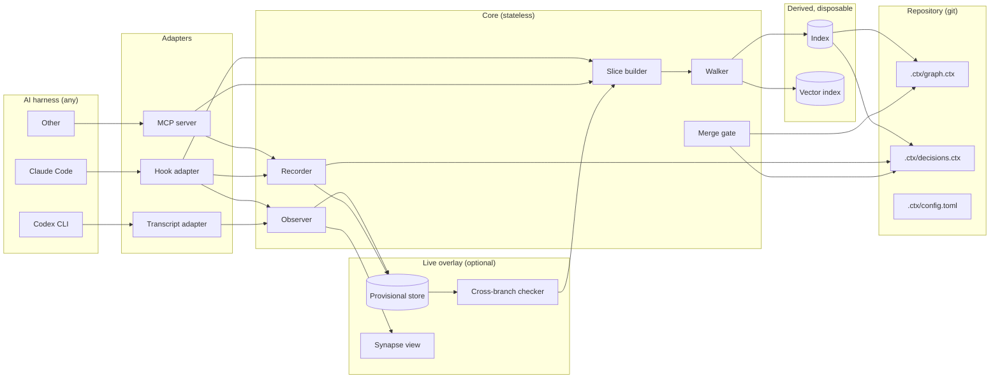

# Context Graph design specification

| | |
|---|---|
| Working name | Context Graph. Rename freely; nothing below depends on it. |
| Status | Draft for review |
| Date | 2026-09-07 |
| Author | Warren Langeveldt, drafted with Claude |

## 1. Purpose

AI coding agents derive "what good looks like" from whatever they happen to read in a session. That derivation is local, invisible, and lost when the session ends. Two failures follow:

- **Vertical.** A change can be correct at the line and method level and wrong at the module or domain level, because the agent never established what those layers require. Locally good, contextually wrong.
- **Temporal.** The next session re-derives the same context from scratch and may land somewhere different. The codebase accumulates decisions that are each defensible and jointly inconsistent. Nothing records that a decision was made, so the next agent cannot even know to ask.

Context Graph is a standalone, codebase-agnostic, harness-agnostic plugin that addresses both. It has two halves:

1. **Observation.** Record exactly what context an agent built before each change: which files it read in full, which it saw only through grep, which it edited on the strength of a file name alone.
2. **Anchor.** Hold the engineering and architecture context outside any session as a small, traversable graph of physical, logical, and conceptual nodes, with constraints and dated decisions attached, and inject the applicable slice at the moment an agent is about to change something.

The two halves close a loop. The observation shows what context was built. The graph shows what context applied. The difference is measurable per edit.

## 2. Principles

1. **The walker sets the floor; the agent pulls above it.** The plugin resolves the applicable context deterministically and hands the agent a slice before every edit. The agent never reads the whole graph by default, but it may traverse further through the query surface whenever its judgment says the slice is not enough. What is never delegated to the agent is the floor itself, because coverage and the merge gate are only meaningful against a reproducible applicable set.
2. **Inject late and small.** A slice of a few hundred tokens delivered immediately before an edit outperforms a complete graph delivered at session start.
3. **Git is the source of truth.** The graph lives in the repository as text. Decisions ride the branch that justifies them, merge when it merges, and die when it is abandoned. The graph diff is part of the pull request.
4. **Live state is an overlay, never truth.** A shared service may hold provisional, unmerged decisions and in-flight observations for early warning. If it is down, early warning is lost and nothing else.
5. **A why must point at something.** Every decision names the constraint or concept it serves, or the one it deliberately overrides. A why that points at nothing is rejected.
6. **Enumerate deviations, not the codebase.** Directory structure already encodes containment. The graph records only what a path cannot tell you.
7. **Humans ratify the top of the stack.** Agents may propose logical nodes and guided constraints. Conceptual nodes and enforced constraints become active only when a person accepts them.
8. **Codebase-agnostic and harness-agnostic.** The core knows nothing about any particular repository or AI tool. Adapters normalise harness events; a bootstrap derives the initial graph from any tree.
9. **Legible over clever.** Every injected line must be traceable to a graph walk a human can read. Retrieval by similarity is permitted only as a clearly marked hint.

## 3. Vocabulary

| Term | Meaning |
|---|---|
| Physical node | A file or an exported symbol. Identified by repository-relative path, optionally `#symbol`. Never authored; derived from the tree. |
| Logical node | A module, package, contract, or seam. Identified by a short slug. Authored or proposed. |
| Conceptual node | A domain concept or architectural principle. Identified by a short slug. Authored by a person, optionally pointing at an ADR. |
| Mapping | A glob-to-logical-node rule that turns a path into its containing module. |
| Constraint | A statement attached to a node, with a mode. |
| Mode | `E` enforced (a test exists), `G` guided (injected before edits), `R` recorded (history only). |
| Decision | A dated, attributed record of what changed and why, pointing at a constraint or concept. |
| Supersession | An edge stating that one decision replaces another. Decisions are never deleted. |
| Provisional | A decision on a branch that has not merged. |
| Slice | The rendered, imperative context injected before an edit. |
| Observation event | One normalised record of an agent touching a file, with access mode. |
| Coverage | For one edit, the set of applicable graph nodes that were in the agent's context, versus the set that applied. |

## 4. Architecture



**Flow for one edit.** The harness signals that the agent is about to edit a path. The adapter calls the slice builder. The walker resolves the path to its logical chain via mappings, collects constraints on every node in the chain, collects the newest decisions on those nodes, overlays any provisional decisions the live store knows about, and renders the slice. The adapter injects it. After the edit, the observer records the touch. Before the turn ends, the recorder demands a decision for every edited node that has an active constraint, validates the arrow, and appends it.

## 5. Repository layout in a target codebase

```
.ctx/
  config.toml        plugin settings for this repository
  graph.ctx          mappings, logical nodes, conceptual nodes, edges, constraints
  decisions.ctx      append-only decisions and supersessions
  aliases.ctx        short aliases for frequently referenced nodes (optional)
```

Three files, all text, all diffable. `graph.ctx` changes rarely and is reviewed like architecture. `decisions.ctx` grows with every change and is reviewed like a changelog. Splitting them keeps the review signal clean.

## 6. Graph format

One record per line. The first token is the record kind. Fields are whitespace-separated in fixed order; the last field may contain spaces. Lines beginning with `#` are comments. Field order is fixed so a reader never searches for a key.

```
M <glob> <logical-id>
L <logical-id> <name>
C <concept-id> <name> [adr:<ref>]
E <from> <rel> <to>
K <mode> <k-id> <attached-to> <text> [test:<path>] [from:<pack>@<version>]
D <d-id> <date> <who> <sha> <branch> <node> -><k-id|c-id> [!<k-id>] <text>
S <new-d-id> <old-d-id>
Z <k-id|c-id> <date> <who> [succ:<id>] <reason>     retirement, see §21.2
A <alias> <node>
R <{role}> <detection heuristic>          pack files only, see §16.1
```

### 6.1 Records

**`M` mapping.** Turns a path into a logical node. First matching glob wins; order the file from most specific to least.

```
M api/src/platform/core/orchestration/** L:orchestration
M api/src/platform/core/**               L:platform-core
M api/src/platform/integrations/**       L:integrations
M api/src/teams/*/**                     L:team
```

**`L` logical node.** A module, contract, or seam.

```
L L:orchestration   Workspace orchestration and blackboard
L L:platform-core   Engine and DSL contracts, pure
```

**`C` conceptual node.** Authored by a person. May point at an ADR by any reference the team uses.

```
C C:engine-pure     The engine never depends on its implementations   adr:0012
C C:team-agnostic   Every platform mechanism generalises to any team
```

**`E` edge.** Relations are a closed vocabulary of short words with strong priors: `in` containment, `impl` implements or serves, `dep` depends on.

```
E L:orchestration in   L:platform-core
E L:platform-core  impl C:engine-pure
E L:platform-core  impl C:team-agnostic
```

Containment of files in modules is never written; mappings supply it.

**`K` constraint.** Attached to any node. Mode is one character.

```
K E boundary.no-team-imports  L:platform-core  core never imports integrations or teams  test:api/src/platform/platform-boundary.test.ts
K G orch.store-mutation       L:orchestration  workspace state changes only via blackboard events, never direct writes
K G orch.envelope             L:orchestration  confidence is an envelope field, never in payload
K R legacy.frozen-team        L:team           the deprecated team is read-only
```

An `E` constraint must carry `test:`. The gate runs it. A constraint proposed by an agent carries mode `G?` until ratified, and `G?` constraints are injected with a `proposed` marker.

**`D` decision.** The record that carries state and why.

```
D d-0417 2026-08-29 warren/claude 4b9947ac feature/liaison  api/src/operations/team-queue-purge.ts  ->K orch.store-mutation  purge guard added; direct delete path rejected
D d-0418 2026-08-29 warren/claude -        feature/liaison  L:orchestration  ->C engine-pure  !K orch.envelope  reviewer verdict now stored in envelope by design; overrides envelope rule for verdicts only
```

Fields:

| Field | Rule |
|---|---|
| `d-id` | Monotonic per repository, assigned by the recorder. |
| `date` | ISO date. |
| `who` | `person/agent`. Person from git identity. Agent from the adapter. |
| `sha` | Commit that carried the change, or `-` while uncommitted. A post-commit hook rewrites `-` to the SHA. |
| `branch` | Branch at time of recording. Provisional until merged. |
| `node` | Path, `path#symbol`, or a logical or conceptual id. A decision may attach to a module when no single file is the anchor. |
| `->` | Mandatory. The constraint or concept the decision serves. |
| `!` | Optional. A constraint the decision deliberately overrides. Must name an existing constraint. |
| text | Free text. Kept short. |

**`S` supersession.** Never delete a decision.

```
S d-0418 d-0391
```

**`A` alias.** Short names for nodes the slice references often. Saves tokens; nothing else depends on it.

```
A bb api/src/platform/core/orchestration/blackboard.ts
```

### 6.2 Validation rules

Applied on every write and by the merge gate:

1. Every `->` and `!` target exists.
2. Every `E` constraint carries `test:` and the file exists.
3. Every `S` names two existing decisions, and the old one is not already superseded on the same branch.
4. No `C` record is added or changed by an agent identity without a ratification marker in the same commit (see §11).
5. Mappings cover every path that has a decision or a constraint attached.
6. Aliases are unique and resolve.

### 6.3 Why this format

Token cost matters because every slice is paid for on every edit. Measured against the same content, JSON costs roughly 1.4 times the tokens and YAML roughly 1.2, and the extra characters are delimiter, not signal. Beyond cost, regularity matters more than delimiters to a model: fixed field order means position carries meaning.

Short words with strong priors (`in`, `impl`, `dep`, `must`) cost one token each and need no legend. Invented symbols cost a legend, and the legend costs attention on every read.

## 7. Walker and slice builder

### 7.1 Walk

Given a path about to be edited:

1. Resolve the path to its logical node via the first matching `M`.
2. Follow `in` edges upward to build the chain: file, module, parent modules.
3. Follow `impl` edges from every node in the chain to collect concepts.
4. Collect every `K` attached to any node in the chain or its concepts.
5. Collect every `D` whose node is the path, any symbol in the path, or any node in the chain. Drop superseded decisions and decisions whose basis is retired without a successor. Keep the newest N. The walker reads active files only; the archive (§21.3) is never opened on the edit path.
6. If the live overlay is reachable, fetch provisional decisions and in-flight touches for the same node set.
7. If the vector index is enabled, retrieve hints (see §10) and mark them.

The walk is deterministic and its result is loggable as a list of node ids. That list is the "applicable set" used by the coverage metric.

### 7.2 Render

The slice is rendered imperatively, in the shape of the action, not as facts about the file.

```
edit bb
  chain  L:orchestration > L:platform-core  impl C:engine-pure C:team-agnostic
  must   no import from integrations|teams              [E boundary.no-team-imports]
  must   state change via blackboard events only        [G orch.store-mutation]
  must   confidence stays in envelope, not payload      [G orch.envelope]
  last   d-0417 08-29 warren/claude  purge guard added; direct delete rejected
  last   d-0391 07-20 warren/claude  confidence moved out of fields (doc-reader v2)
  live   maral/codex on feature/x has this file open   (2h ago)
  live   d-p12 provisional maral/codex  overrides orch.envelope for verdicts  <- conflicts with what you are about to honour
  hint   docs/discovery/2026-07-10-rule-prosecution.md  0.81  "envelope vs payload debate"
```

Ordering, fixed:

1. `chain` one line, so the agent sees position.
2. `must` lines: enforced first, then guided, most specific node first.
3. `last` lines: newest first, capped by `slice.max_decisions` (default 4).
4. `live` lines: only when the overlay is reachable.
5. `hint` lines: only when the vector index is enabled, capped by `slice.max_hints` (default 2), always with a score.

Budget: `slice.max_tokens` (default 300). When the budget is exceeded, drop hints first, then oldest decisions, then `R` constraints. Never drop an `E` or `G` constraint; if they alone exceed the budget, the graph is too fine-grained at that node and the walker emits a warning to the observer stream.

### 7.3 Symbol-level resolution

When the harness supplies a line range with the edit (most do), the walker looks up the enclosing exported symbol via a language-aware parser and includes constraints and decisions attached to `path#symbol`. Symbol-level nodes are a refinement; file level must work on its own.

## 8. Observation stream

Every touch an agent makes is normalised to one event:

```json
{
  "ts": "2026-09-07T03:14:07.221Z",
  "session": "8a2a30aa",
  "who": "warren/claude",
  "branch": "feature/liaison",
  "tool": "Bash",
  "path": "api/src/platform/core/orchestration/blackboard.ts",
  "mode": "range",
  "range": [340, 420],
  "bytes": 3120,
  "origin": "main"
}
```

### 8.1 Access modes

| Mode | Meaning | How it is detected |
|---|---|---|
| `full` | Whole file entered context | Read tool without range; `cat`; `sed -n 1,$p` |
| `range` | A line range entered context | Read with offset and limit; `sed -n a,bp`; `head`; `tail` |
| `grep` | Only matching lines entered context | Grep tool; `grep`, `rg`, `ag` in shell |
| `name` | Only the path entered context | Directory listings; `ls`; `find`; `git ls-files`; import paths in another read file |
| `edit` | A region was changed | Edit tool; `sed -i`; patch application |
| `write` | The file was created or replaced | Write tool; heredoc redirection; `cp` over an existing path |
| `delegated` | A subagent touched it; nothing entered the parent's context except the subagent's report | Subagent transcripts, attributed by parent session |
| `summarized` | Earlier context was compacted; the file survives only as a summary | Compaction events from the harness |

Shell parsing is mandatory. In a representative long session the tool mix was Bash 964, Edit 134, Read 57, Write 29. An observer that only watches the dedicated read tool misses most of the context being built. The Bash parser recognises `cat`, `head`, `tail`, `sed -n`, `grep`, `rg`, `ag`, `ls`, `find`, `git show`, `git diff`, `git log -p`, pipes, and redirections, and maps each to a mode. Unrecognised commands emit a `name` event for every path-like argument and an `unparsed` flag.

### 8.2 What is recorded per edit

When an `edit` or `write` event arrives, the observer snapshots the context state for that path: every prior event on any node in the applicable set for this session, with mode and recency, and whether a `summarized` event has occurred since. That snapshot plus the walker's applicable set is the coverage record:

```json
{
  "edit": "evt-1193",
  "path": "api/src/platform/core/orchestration/blackboard.ts",
  "applicable": ["L:orchestration", "L:platform-core", "C:engine-pure", "K:orch.store-mutation", "d-0417"],
  "loaded": {
    "api/src/platform/core/orchestration/blackboard.ts": "range",
    "api/src/platform/core/orchestration/blackboard.test.ts": "grep"
  },
  "callers_loaded": 0,
  "callers_total": 6,
  "slice_injected": true,
  "summarized_since": false
}
```

Callers are resolved from a language-aware import graph built by the indexer. "Edited with zero callers loaded" is the single most useful signal the observation half produces.

### 8.3 Storage

Events append to `~/.ctx/observations/<repo-hash>/<session>.jsonl` locally. Forwarding to the live overlay is opt-in per stream (§11.4).

## 9. Recording decisions

### 9.1 When

At the end of every turn in which an `edit` or `write` event touched a node with at least one active `E` or `G` constraint, the adapter blocks the turn from ending until the agent has recorded a decision for each such node, or explicitly declined with a reason. Declining is itself recorded as a decision with `->` pointing at the most specific constraint and text `no-decision: <reason>`.

Edits to nodes with no active constraints do not require a decision. This keeps the demand proportional and stops boilerplate.

### 9.2 How

The adapter presents the pending nodes and the recorder accepts a `D` record per node through the MCP tool `ctx.record` or through a structured hook response. Validation runs immediately:

- `->` target must exist. If it is outside the applicable set for that node, the decision is accepted and an edge is proposed (§9.3), so the reach is recorded rather than refused.
- `!` target must exist and must be an active constraint.
- A decision whose `!` overrides an `E` constraint is rejected outright. Enforced constraints are changed by changing the test, not by decision.
- A decision whose text contradicts an active `G` constraint without a `!` is flagged, not rejected, and the flag is written to the observation stream as a finding.

### 9.3 Reach beyond the walk

The walker follows structural edges only. Relevance that is semantic rather than structural, such as a decision on a sibling module about the same behaviour, is not in the slice. The design accepts that and turns it into graph growth:

- When the agent pulls beyond the slice through the query surface, the observer records a `reach` event naming the nodes it consulted.
- When a decision's `->` or `!` target is outside the applicable set for the edited node, the recorder accepts it (the target must still exist) and proposes an `E` edge from the edited node's logical parent to the target's, marked proposed.
- A proposed edge that is reached again from the same pair of nodes is promoted to ratification. Semantic reach that repeats becomes structure, and the walker finds it next time.

The alternative of a model ranking or filtering constraints inside the walker is deliberately excluded from the first version. It makes the applicable set nondeterministic, which breaks coverage and the gate. If ranking is ever added, it orders within a deterministic set and both orderings are logged.

### 9.4 Provenance

`sha` is `-` at record time. A post-commit hook rewrites `-` to the commit SHA for every decision whose node was changed in that commit. A decision still carrying `-` when its branch is pushed is a gate warning.

## 10. Embeddings (optional, standalone)

Similarity retrieval cannot replace the walk. Applicability is structural: the constraint "core never imports from teams" applies to a file whether or not an edit's text resembles it. Embeddings serve a different job: surfacing related material the graph does not link.

### 10.1 What is indexed

- Decisions (text plus their `->` and `!` targets and node chain).
- Constraints.
- Prose the team designates in config: ADRs, discovery notes, design docs.
- Code chunks, split by a language-aware chunker at symbol boundaries, never by line count.

### 10.2 Contextual prefix

Every chunk is embedded with a prefix generated by the walker: the chain line for its path plus the ids of its active constraints. A function does not embed as an orphan. The graph supplies the situating context that makes retrieval precise; retrieval supplies the associations the graph lacks.

### 10.3 Interfaces

The plugin depends on three interfaces and ships at least one implementation of each. Nothing in the core names a vendor.

```ts
interface EmbeddingProvider {
  id: string;            // e.g. "local:nomic-embed-text", "openai:text-embedding-3-large"
  dimensions: number;
  embed(texts: string[]): Promise<Float32Array[]>;
}

interface Chunker {
  chunk(path: string, content: string): Chunk[];   // symbol-boundary aware
}

interface VectorStore {
  upsert(items: { id: string; vector: Float32Array; meta: Record<string, unknown> }[]): Promise<void>;
  query(vector: Float32Array, k: number, filter?: Record<string, unknown>): Promise<{ id: string; score: number }[]>;
  remove(ids: string[]): Promise<void>;
}
```

Reference implementations: a local provider through an Ollama-style HTTP endpoint, a hosted provider through any OpenAI-compatible embeddings endpoint; a tree-sitter chunker; a SQLite-backed vector store for local mode and a Postgres-with-pgvector store for hosted mode.

### 10.4 Rules

- Results are hints. The slice marks them `hint` with a score. Never `must`.
- A threshold (`embed.min_score`, default 0.75) applies. Below it, no hints.
- The index is derived and disposable. It is rebuilt from repository plus graph, never backed up or migrated.
- Re-index changed chunks on post-commit. Never on every edit.
- The index is per repository and per embedding provider id. Changing provider rebuilds.

## 11. Merge gate

Git detects textual overlap. Decision conflicts are semantic and usually touch different lines, so they merge cleanly and silently. The gate is a three-way semantic diff of the graph: base at merge point, main now, branch now.

### 11.1 Checks

| Check | Condition | Severity |
|---|---|---|
| Opposed arrows | Branch serves K; main since overrode K. Or the reverse. | Fail |
| Double supersession | Branch supersedes D1; main already superseded D1 with D2. | Fail |
| Stale basis | A branch decision's `->` target changed on main since the branch point. | Warn (configurable to fail) |
| Context moved | Branch edited a path; main changed a constraint applicable to that path. | Warn |
| Enforced constraints | Run every `test:` on the merged tree. | Fail on test failure |
| Unratified proposals | Branch adds `C` or `E` records, or `G?` constraints, without ratification. | Fail for `C` and `E`; `G?` merges as proposed |
| Unlinked provenance | Decisions with `sha` still `-`. | Warn |
| Orphaned basis | An active decision whose `->` or `!` target is retired with no successor. | Warn until superseded or re-pointed |
| Unratified retirement | A `Z` on a `C` or `E` record without a ratification trailer. | Fail |
| Coverage | Any edit in the branch recorded with zero callers loaded and no decision. | Warn |

### 11.2 Output

The gate never emits a bare failure. For each finding it prints the two decisions involved, both whys, both authors, the node, and a suggested resolution. Resolution suggestions may be generated by a model from the two records; acceptance is human.

```
FAIL opposed-arrows  L:orchestration / K orch.envelope
  main   d-0420 2026-09-03 maral/codex   ->K orch.envelope   reaffirmed: verdicts also stay in payload
  branch d-0418 2026-08-29 warren/claude !K orch.envelope   verdicts move to envelope
  suggest: one of these supersedes the other; record S and re-run
```

### 11.3 Where it runs

- **Required:** on the pull request in CI, against `merge-base`. Deterministic, no network beyond the repository.
- **Optional:** as a pre-push hook locally.
- **Optional:** continuously, cross-branch, in the live overlay (§12).

### 11.4 Ratification

A `C` record or an `E` constraint becomes active when a commit touching it carries a trailer `Ctx-Ratified-By: <person>` from an identity listed in `config.toml` under `ratifiers`. The gate checks the trailer. This keeps ratification inside the tool the team already uses for review.

## 12. Live overlay (optional service)

### 12.1 Scope

The overlay holds only what git cannot hold yet:

- Provisional decisions from unmerged branches, streamed as recorded.
- In-flight touches: which files each active session is reading and editing, with mode.
- Cross-branch checks: the §11 checks run continuously across every pair of in-flight branches, with findings pushed to the two sessions involved.
- Aggregated observations for the synapse view and coverage reporting.

### 12.2 Properties

- **Overlay, not truth.** On merge, a branch's provisional entries retire because git now holds them.
- **Graceful degradation.** Unreachable overlay means the slice omits `live` lines and nothing else changes. The gate still runs at merge.
- **Same code, two modes.** Local mode runs the same service on the developer machine with no forwarding. Hosted mode runs it once for the team.
- **Identity from git.** The overlay keys on `person/agent` and trusts the repository remote's authentication. No second account system.
- **Privacy.** Observation forwarding is opt-in per stream. The default consumer of forwarded observations is the aggregate view, not a per-person feed. Retention is configurable and defaults to thirty days.

### 12.3 API

```
POST /v1/{repo}/provisional        record or retire a provisional decision
GET  /v1/{repo}/provisional?nodes= provisional decisions touching these nodes
POST /v1/{repo}/touch              in-flight touch event
GET  /v1/{repo}/touch?path=        who has this path open
GET  /v1/{repo}/conflicts?branch=  live cross-branch findings for a branch
POST /v1/{repo}/observe            forwarded observation batch (opt-in)
WS   /v1/{repo}/stream             event stream for the synapse view
```

## 13. Query surface

An MCP server exposes the graph to any harness that speaks MCP. Hooks push; MCP pulls. Both are needed: push for the deterministic floor at edit time, pull for the agent's own traversal when the slice is not enough (§9.3), and for audit and explanation. Every pull is observed as a `reach` event so the difference between what was pushed and what the agent went and found is visible in the synapse view.

| Tool | Purpose |
|---|---|
| `ctx.hydrate(scope, budget?)` | One bounded briefing for a file, module (`L:`), concept (`C:`), or task description: the slice per distinct chain, callers with the lines that use each file and whether they are already in context, decision history behind the rules in force, what the session already holds, hints, and teammates' open files. Drop order under budget: hints, callee lists, older decisions, caller usage lines, callers beyond three, live lines, files beyond three; rules are never dropped. Observed as a `reach` event plus `range` touches for the caller lines returned. Optionally run at prompt time for the paths and module ids a prompt names (`slice.hydrate_on_prompt`, off by default). |
| `ctx.slice(path, range?)` | The rendered slice for a path. Same output the hook injects. |
| `ctx.slice_patch(patch)` | Slices for every file named in a unified patch, concatenated under the budget. Used by harnesses whose edits arrive as patches. |
| `ctx.why(node)` | Active decisions on a node with full text and provenance. |
| `ctx.history(node, limit?)` | All decisions including superseded, newest first. |
| `ctx.applies(path)` | The applicable set as ids, for audit. |
| `ctx.record(decision)` | Record a decision. Validates and returns the id or the rejection. |
| `ctx.check(branch?)` | Run the merge gate locally against main. |
| `ctx.coverage(session?)` | Coverage records for the current or a named session. |
| `ctx.propose(record)` | Propose an `L`, `G?`, or `C` record for ratification. |

Resource: `ctx://graph` returns the chain and constraints for the whole repository as a compact text document, for the rare case an agent needs the forest.

## 14. Synapse view

The observation stream drives a graph visualisation of the codebase. Its purpose is to make visible what context each agent actually built.

- **Nodes.** Files, sized by lines. Logical and conceptual nodes as larger hubs.
- **Edges.** Import graph from the indexer. Containment from mappings. `impl` edges from the graph.
- **Brightness.** How much of the file entered context in the selected session: `full` brightest, `range` proportional, `grep` dim, `name` outline only.
- **Colour.** Access mode. Edits and writes in a distinct hue.
- **Time.** A scrubber replays the session. Nodes light in order. An edit flashes on a node whose neighbours are dark.
- **Coverage overlay.** For each edit, draw the applicable set. Applicable nodes that never lit are the gap. The count of those per edit is the headline number.
- **Multi-session.** In hosted mode, overlay several sessions with one colour per `person/agent`.

### 14.1 Local event server

`ctx serve` runs the §12 service in local mode. It is the same binary and the same endpoints as the hosted overlay, bound to loopback, with forwarding off. One process per machine, not per session: a developer running several harness sessions in parallel gets one view with every session on it.

- **Discovery.** Port from `~/.ctx/config.toml` under `serve.port` (default 7399). The chosen port is written to `~/.ctx/serve.json` so hooks and the CLI find it without configuration.
- **Ingest.** Hooks post normalised events to `POST /v1/local/observe` in batches. Claude Code can do this with its native `http` hook type and no script. Codex hook scripts post from the command hook. If the server is not running, hooks append to the observation JSONL files only, exactly as they do today; `ctx serve` replays those files on start and tails them thereafter. The server is therefore never required for correctness, which keeps principle 4 intact on a single machine as well as across a team.
- **Beyond touches.** The same hooks emit richer events the view needs and the §8 touch record does not carry: the slice that was injected for an edit with its applicable set, the decision that was recorded, session start and end with harness and worktree, and compaction with the paths it summarised.
- **Holds.** An in-memory ring buffer per session (`serve.buffer_events`, default 50,000), the coverage records, and a graph snapshot from the indexer: file nodes, import edges, mappings, and `impl` edges.
- **Serves.** The static view at `/`, `GET /v1/local/graph` for the snapshot, `GET /v1/local/sessions`, and `WS /v1/local/stream?session=&since=` which replays from the buffer to the requested sequence number and then goes live.
- **Hosted.** Identical endpoints under `/v1/{repo}/`, fed by forwarded observations. The view connects to whichever base URL it is given.

### 14.2 Stream protocol

One JSON envelope per message, over WebSocket:

```json
{ "t": "edit", "seq": 48213, "ts": "2026-09-07T03:14:07.221Z",
  "session": "8a2a30aa", "who": "warren/claude", "branch": "feature/liaison",
  "p": { "path": "api/src/platform/core/orchestration/blackboard.ts", "range": [340, 420] } }
```

| `t` | Payload |
|---|---|
| `touch` | The §8 event: path, mode, range, bytes, origin. |
| `edit` | Same, for `edit` and `write` modes, emitted separately so the view can pulse. |
| `slice` | `path`, `applicable` node ids, `tokens`, `rendered` text. |
| `reach` | Nodes the agent consulted through the query surface beyond the slice, with the tool used. |
| `decision` | The `D` record as written. |
| `coverage` | The §8.2 record. |
| `session` | `start` or `end`, `harness`, `cwd`, `worktree`, `arm` (injection on, off, or randomised assignment). |
| `compact` | `paths` that were summarised. |

`seq` is monotonic per server. A client that disconnects reconnects with `since=<seq>` and misses nothing that is still in the buffer. Server-sent events would carry the same envelope if a deployment cannot hold a WebSocket; the view treats the transport as a detail.

### 14.3 Rendering

Three.js, through the 3d-force-graph library, which pairs Three.js with a three-dimensional port of the d3 force layout. Chosen over a hand-rolled scene because it gives the four things the synapse view needs and little else: mutating the graph without re-laying out the whole scene, a custom Three.js object per node for the glow, directional particles along a link to animate a read propagating into an edit, and a post-processing hook for bloom so lit nodes read as lit. Rendering runs on the GPU; the layout runs on the CPU and is the practical ceiling.

- **Level of detail.** Default collapsed to logical nodes, one sphere per module, sized by file count. A module expands to its files on click, or automatically when a session touches it. Repositories under `view.expand_threshold` nodes (default 1,500) open fully expanded. Beyond roughly ten thousand visible nodes the layout stops being readable, and the collapsed default holds.
- **Two views, both first class.** The 3D view is for seeing what lit up and where the dark neighbours are. Beside it, a 2D mode using the same library's two-dimensional sibling, and a coverage table listing each edit with its applicable set and which of those nodes were loaded, in what mode. The 3D view is how you notice; the table is how you audit. Neither is optional.
- **Time.** A scrubber replays from the buffer. Live mode follows the latest sequence number. Pulses and particles fall back to a static highlight under `prefers-reduced-motion`.
- **Build.** A static single-page application in TypeScript, bundled with Vite, no framework. Served by `ctx serve` locally and by any static host in hosted mode.

### 14.4 What the view answers

The encodings and the stream exist to answer four questions, and the design is judged on how directly it answers them:

1. For this edit, which applicable nodes lit, and which stayed dark.
2. What slice was injected before this edit, and did the edit's decision point back at it.
3. Which sessions touched this file today, and in what mode.
4. Across a session, or a team in hosted mode, which files are edited with the fewest of their callers loaded.

## 15. Harness adapters

### 15.0 Normalised contract

Every adapter provides the following, or declares which it cannot:

| Capability | Needed for | Required |
|---|---|---|
| Pre-edit interception with context injection | Slice | Yes, or a substitute |
| Post-tool observation with full tool input | Observation | Yes |
| Turn-end block until a condition is met | Decision recording | Yes, or a substitute |
| Session start context | Loading the alias table and chain summary | Preferred |
| Transcript access with full tool arguments | Offline observation, replay | Preferred |
| Subagent attribution | `delegated` mode | Preferred |
| Compaction signal | `summarized` mode | Preferred |
| MCP client | Query surface | Yes |

Where a harness lacks pre-edit interception, the substitute is instruction plus tool: the harness's instruction file directs the agent to call `ctx.slice` before every edit, and the observer verifies from the transcript that it did, recording a `slice_injected: false` finding when it did not.

### 15.1 Claude Code adapter

Facts below are from the official hooks, plugins, MCP, skills, and headless references at code.claude.com/docs, checked 2026-09-05. Claude Code satisfies every row of the §15.0 contract natively, and adds two surfaces the core design did not assume: a background monitor that can push overlay findings into a live session, and a hook type that calls an MCP tool directly without spawning a shell.

#### Packaging

The adapter ships as a Claude Code plugin. Layout rules from the reference: the `.claude-plugin/` directory holds only the manifest; every other component sits at the plugin root; organisation-distributed plugins may not carry a top-level `bin/`, so executables live under `scripts/` and are referenced through `${CLAUDE_PLUGIN_ROOT}`.

```
adapters/claude-code/
  .claude-plugin/plugin.json
  hooks/hooks.json
  .mcp.json
  monitors/monitors.json
  skills/ctx/SKILL.md
  scripts/
    ctx-hook          one entrypoint; the event name selects the handler
    ctx-mcp           the MCP server, stdio
    ctx-overlay-tail  prints one line per live finding, for the monitor
```

Manifest:

```json
{
  "name": "context-graph",
  "version": "0.1.0",
  "description": "Per-edit context slices, decision recording, and context observation for any repository",
  "mcpServers": {
    "ctx": { "command": "${CLAUDE_PLUGIN_ROOT}/scripts/ctx-mcp" }
  }
}
```

Bundled MCP tools are named `mcp__plugin_context-graph_ctx__<tool>`, so `ctx.slice` is reachable as `mcp__plugin_context-graph_ctx__slice`. Permission matchers use the wildcard `mcp__plugin_context-graph_ctx__.*`.

Environment available to every hook: `CLAUDE_PROJECT_DIR` (repository root, stable across worktrees), `CLAUDE_SESSION_ID`, `CLAUDE_PLUGIN_ROOT`, and `CLAUDE_PLUGIN_DATA` (persistent plugin state). Per-session recorder state lives under `CLAUDE_PLUGIN_DATA`; observation files stay under `~/.ctx` so the transcript adapter and other harnesses share one location.

#### Event mapping

Every hook receives `session_id`, `transcript_path`, `cwd`, `hook_event_name`, and, when fired inside a subagent, `agent_id` and `agent_type`. Tool events add `tool_name`, `tool_input`, and `tool_use_id`.

| Need | Event | Matcher | Hook type | Mechanism |
|---|---|---|---|---|
| Slice before a tool edit | `PreToolUse` | `Edit\|Write\|MultiEdit\|NotebookEdit` | `mcp_tool` | Calls `ctx.slice` with `${tool_input.file_path}`. Returns `additionalContext`. No shell spawn. |
| Slice before a shell edit | `PreToolUse` | `Bash` | `command` | Parses `tool_input.command`; if it writes a path (`sed -i`, heredoc redirection, `patch`, `cp` onto an existing file), resolves the targets and returns the slice as `additionalContext`. |
| Observation | `PostToolUse` | `*` | `command`, `async: true` | Normalises `tool_name` plus `tool_input` to one §8 event per touched path. Never blocks; the reference marks this event non-blockable, which is the behaviour wanted. |
| Failed attempts | `PostToolUseFailure` | `*` | `command`, `async: true` | Same event with `mode: failed`. |
| Turn-end decision demand | `Stop` | `""` | `command` | Computes pending nodes. If any, exits 2 with a reason that lists them and the `ctx.record` shape. Claude records through MCP, then the next `Stop` passes. |
| Subagent turn-end | `SubagentStop` | `""` | `command` | Same as `Stop`, decisions attributed with `agent_id`. |
| Session context | `SessionStart` | `startup\|resume\|clear\|fork` | `command` | Plain-text stdout is added as context on this event. Emits the alias table, the top-level chain summary, and the instruction to call `ctx.slice` before shell-driven edits. |
| Compaction signal | `SessionStart` | `compact` | `command` | Emits a `summarized` event for every path read so far in the session, then re-emits the alias table. |
| Delegated attribution | `SubagentStart` / `SubagentStop` | `*` | `command`, `async: true` | Opens and closes a delegation window keyed on `agent_id`; touches inside it carry `mode: delegated` for the parent session. |
| External writes | `FileChanged` | `*` | `command`, `async: true` | `file_path` and `change_type` for writes that no tool call explains. |
| Live findings into the session | monitor | | `monitors/monitors.json` | Runs `ctx-overlay-tail` in the background; each stdout line notifies Claude. This is the push channel for cross-branch conflicts from §12. |
| Worktree awareness | `WorktreeCreate` / `WorktreeRemove` | `*` | `command`, `async: true` | Records `worktree_path` so branch attribution is correct per worktree. |

`hooks/hooks.json`, abbreviated:

```json
{
  "hooks": {
    "PreToolUse": [
      {
        "matcher": "Edit|Write|MultiEdit|NotebookEdit",
        "hooks": [{ "type": "mcp_tool", "server": "ctx", "tool": "slice",
                    "input": { "path": "${tool_input.file_path}" } }]
      },
      {
        "matcher": "Bash",
        "hooks": [{ "type": "command", "command": "${CLAUDE_PLUGIN_ROOT}/scripts/ctx-hook", "timeout": 5 }]
      }
    ],
    "PostToolUse": [
      { "matcher": "*",
        "hooks": [{ "type": "command", "command": "${CLAUDE_PLUGIN_ROOT}/scripts/ctx-hook", "async": true }] }
    ],
    "Stop": [
      { "matcher": "",
        "hooks": [{ "type": "command", "command": "${CLAUDE_PLUGIN_ROOT}/scripts/ctx-hook", "timeout": 10 }] }
    ],
    "SessionStart": [
      { "matcher": "startup|resume|clear|fork|compact",
        "hooks": [{ "type": "command", "command": "${CLAUDE_PLUGIN_ROOT}/scripts/ctx-hook" }] }
    ]
  }
}
```

When `ctx serve` is running, the observation hook may instead be declared with Claude Code's native `http` hook type, posting the event JSON straight to the local server's `/v1/local/observe`, and the server appends the observation file itself. The command hook stays the default because it works with no server present.

Implementation note: the first build declares command hooks for every event, including the pre-edit slice, because a command hook works before the MCP server is registered and costs one Node start. The `mcp_tool` form above is the optimisation to switch to once the bundled server is always present.

#### Stop-hook loop guard

A `Stop` hook that exits 2 causes Claude to continue the turn and then stop again, which fires the hook again. The recorder keeps a per-session counter under `CLAUDE_PLUGIN_DATA`. After `record.max_blocks` consecutive blocks on the same pending set (default 2), the hook stops blocking, records `no-decision: unrecorded after N prompts` for each pending node, and writes a finding to the observation stream. The decline-with-reason path in §9.1 is always available to the model as the intended exit.

#### Transcript adapter

Every hook input carries `transcript_path`. The transcript is a JSONL file the reference calls a stable public format: `tool_use` lines with the full `input` object and `tool_result` lines with content. The offline adapter (`ctx replay`) reconstructs a session's observation events and coverage records from it without any hook having run, which is how sessions that predate the plugin can be analysed. The reference notes the file is written asynchronously and may lag in-memory state, so replay is for completed sessions, not live use.

#### Query surface

The MCP server in §13 is the bundled `ctx` server. The plugin also ships one skill, `/context-graph:ctx`, which is user-invocable for `why`, `history`, `check`, and `coverage`, and carries `paths` frontmatter so it auto-activates when working files sit under a mapped module. The skill is a convenience; the hooks do not depend on it.

#### Distribution

The plugin repository carries a `.claude-plugin/marketplace.json`. Individuals install with `/plugin marketplace add <owner>/context-graph` then `/plugin install context-graph@<marketplace>`. Teams pin it in the repository's `.claude/settings.json` under `extraKnownMarketplaces` and `enabledPlugins`, which is the right place because the plugin is only meaningful alongside the repository's `.ctx/` files. Organisations can force-enable it through managed policy settings. The manifest declares an explicit `version` so updates are deliberate.

#### Headless and SDK

`claude -p` honours hooks, plugins, and MCP, so a CI or hosted runner gets the same adapter behaviour. `--bare` skips all of them, which disables the plugin entirely; runners must not use it. The Agent SDK exposes the same events programmatically (`HookEvent.PreToolUse`, `HookEvent.PostToolUse`, `HookEvent.Stop`, and the rest) with the same return shape, so the hosted overlay's own runner can wire the adapter in code rather than through the filesystem plugin.

#### Contract coverage

| §15.0 capability | Claude Code |
|---|---|
| Pre-edit interception with context injection | Yes. `PreToolUse` with `additionalContext`. |
| Post-tool observation with full input | Yes. `PostToolUse` with `tool_input`. |
| Turn-end block | Yes. `Stop` is blockable by exit 2 or `permissionDecision: deny`. |
| Session start context | Yes. `SessionStart` plain-text stdout. |
| Transcript with full arguments | Yes. `transcript_path` JSONL. |
| Subagent attribution | Yes. `agent_id` on every event, plus `SubagentStart` and `SubagentStop`. |
| Compaction signal | Yes. `SessionStart` with `start_reason: compact`. |
| MCP client | Yes. Bundled server in the plugin. |
| Live push into session | Yes, beyond contract. Plugin monitors. |

### 15.2 Codex adapter

Facts below are from the Codex documentation at learn.chatgpt.com/docs (the former developers.openai.com/codex pages redirect there), the GitHub releases feed, and the Rust source under `codex-rs/` where the docs were silent, checked 2026-09-07 against Codex CLI 0.153.4. Codex has shipped a hooks engine since release 0.114.0, generally available since May 2026, with a deliberately Claude-compatible shape: the same event names, the same `hooks.json` layout, the same `hookSpecificOutput` response envelope, `Edit` and `Write` accepted as matcher aliases, and `CLAUDE_PLUGIN_ROOT` honoured alongside its own `PLUGIN_ROOT`. The adapter is therefore mostly the same hooks file with three real differences: how edits arrive, how reads arrive, and how hooks are trusted.

#### The three differences

**Edits arrive as patches.** Codex has one write tool, `apply_patch`, and every file change passes through it. `tool_input.command` carries the complete patch text. The adapter parses `*** Add File:`, `*** Update File:`, and `*** Delete File:` headers to recover the paths, then walks each one. One patch may touch several files, so one `PreToolUse` produces one slice per file, concatenated under the budget, and one `PostToolUse` produces one observation event per file with `mode: edit` or `write`. The hunk line numbers give the edit range for symbol-level resolution.

**Reads arrive as shell.** Codex has no dedicated read, grep, or glob tool. Every read is a shell command through the unified exec tool, which hooks see as `tool_name: Bash` with `tool_input.command`. The §8.1 shell parser is therefore the only observation path for reads, not a supplement. This is the strongest argument for the parser being a core component rather than a Claude-specific convenience.

**Hooks must be trusted.** Non-managed hooks are reviewed in-session with `/hooks` and trusted by content hash. Project-level `.codex/` hooks load only in checkouts marked trusted. Managed hooks delivered through `requirements.toml` or MDM bypass review, and an organisation can set `allow_managed_hooks_only`. Automation passes `--dangerously-bypass-hook-trust`. For the plugin this means two distribution paths that must both work: plugin-bundled hooks for individuals, and managed hooks for organisations.

#### Packaging

```
adapters/codex/
  .codex-plugin/plugin.json
  hooks/hooks.json
  .mcp.json
  skills/ctx/SKILL.md
  skills/ctx/agents/openai.yaml
  scripts/
    ctx-hook
    ctx-mcp
```

Manifest:

```json
{
  "name": "context-graph",
  "version": "0.1.0",
  "description": "Per-edit context slices, decision recording, and context observation for any repository",
  "skills": "./skills/",
  "mcpServers": "./.mcp.json",
  "hooks": "./hooks/hooks.json"
}
```

Hook commands receive `PLUGIN_ROOT` and `PLUGIN_DATA`, with `CLAUDE_PLUGIN_ROOT` and `CLAUDE_PLUGIN_DATA` set to the same values, so `scripts/ctx-hook` is one script for both harnesses. The skill's `agents/openai.yaml` declares `dependencies.tools` on the bundled MCP server so the skill and the server install together.

Plugins are not available in the Codex IDE extension. The adapter therefore also ships the same `hooks.json` for `~/.codex/hooks.json` with an install command, `ctx install codex --user`, so IDE users get identical behaviour without the plugin.

#### Event mapping

Every hook receives `session_id`, `transcript_path`, `cwd`, `hook_event_name`, `model`, and `permission_mode`; turn-scoped events add `turn_id`; subagent events add `agent_id` and `agent_type`. Tool events add `tool_name`, `tool_use_id`, `tool_input`, and on `PostToolUse`, `tool_response`.

| Need | Event | Matcher | Hook type | Mechanism |
|---|---|---|---|---|
| Slice before an edit | `PreToolUse` | `apply_patch` | `mcp_tool` | Calls `ctx.slice_patch` with `${tool_input.command}`. The server parses the patch headers and returns one slice per file as `additionalContext`. |
| Slice before a shell edit | `PreToolUse` | `Bash` | `command` | Same parser as Claude Code; the write-detecting branch is rarely hit because Codex routes edits through `apply_patch`, but shell redirection remains possible. |
| Observation of reads | `PostToolUse` | `Bash` | `command`, `async: true` | Shell parser over `tool_input.command`; one event per path with mode `full`, `range`, `grep`, or `name`. |
| Observation of edits | `PostToolUse` | `apply_patch` | `command`, `async: true` | Patch parser; one event per file. `tool_response` confirms which files applied. |
| Turn-end decision demand | `Stop` | `""` | `command` | Returns `{"decision":"block","reason":"..."}` listing pending nodes and the `ctx.record` shape. `stop_hook_active: true` on re-entry is Codex's native loop signal; the adapter honours it in addition to its own counter. |
| Subagent turn-end | `SubagentStop` | `*` | `command` | Same, attributed with `agent_id`. `agent_transcript_path` is available for the transcript adapter. |
| Session context | `SessionStart` | `startup\|resume\|clear` | `command` | `additionalContext` with the alias table and chain summary. |
| Compaction signal | `PreCompact` / `PostCompact` | `manual\|auto` | `command`, `async: true` | `PreCompact` snapshots the paths read so far; `PostCompact` emits `summarized` events for them and re-injects the alias table on the following `SessionStart` with source `compact`. Codex exposes both sides of compaction, which Claude Code does not. |
| Delegated attribution | `SubagentStart` / `SubagentStop` | `*` | `command`, `async: true` | Delegation window keyed on `agent_id`. The `spawn_agent` tool is also visible under the `Agent` alias on `PreToolUse`. |
| Interrupted turns | `Interrupt` | `""` | `command`, `async: true` | Marks pending decisions as interrupted rather than declined. Hard cap of three seconds on this event. |

`hooks/hooks.json`, abbreviated:

```json
{
  "hooks": {
    "PreToolUse": [
      { "matcher": "apply_patch",
        "hooks": [{ "type": "mcp_tool", "server": "ctx", "tool": "slice_patch",
                    "input": { "patch": "${tool_input.command}" }, "timeout": 5 }] },
      { "matcher": "Bash",
        "hooks": [{ "type": "command", "command": "${PLUGIN_ROOT}/scripts/ctx-hook", "timeout": 5 }] }
    ],
    "PostToolUse": [
      { "matcher": "Bash|apply_patch",
        "hooks": [{ "type": "command", "command": "${PLUGIN_ROOT}/scripts/ctx-hook", "async": true }] }
    ],
    "Stop": [
      { "hooks": [{ "type": "command", "command": "${PLUGIN_ROOT}/scripts/ctx-hook", "timeout": 10 }] }
    ],
    "SessionStart": [
      { "matcher": "startup|resume|clear|compact",
        "hooks": [{ "type": "command", "command": "${PLUGIN_ROOT}/scripts/ctx-hook" }] }
    ],
    "PreCompact": [
      { "hooks": [{ "type": "command", "command": "${PLUGIN_ROOT}/scripts/ctx-hook", "async": true }] }
    ],
    "PostCompact": [
      { "hooks": [{ "type": "command", "command": "${PLUGIN_ROOT}/scripts/ctx-hook", "async": true }] }
    ]
  }
}
```

Codex caps `additionalContext` at roughly 2,500 tokens per hook by default and spills larger output to a file with a preview. The §7.2 budget of 300 tokens per file sits well inside it; a multi-file patch is capped at the limit and the walker drops hints and oldest decisions first, as specified.

Hosted tools such as web search do not pass through the local hook path and are not observable. Nothing in the design needs them.

#### Transcript adapter

Codex writes every session to `$CODEX_HOME/sessions/YYYY/MM/DD/rollout-<timestamp>-<thread_id>.jsonl`. Each line is `{"timestamp", "type", "payload"}`. Reads are `response_item` lines of kind `function_call` carrying the shell command; edits are `custom_tool_call` lines carrying the full patch text, paired with `patch_apply_begin` and `patch_apply_end` events that list the per-file change set; MCP calls appear as `function_call` with `mcp__server__tool` names. A `session_meta` line carries `cli_version`, git information, and `parent_thread_id` for subagent rollouts. The file is append-only and can be tailed live.

The documentation states the rollout format is not a stable interface. The adapter pins its parser to `cli_version` from `session_meta` and refuses versions it has not been tested against, emitting a finding rather than guessing. `codex exec --json` offers a simpler, documented event stream (`command_execution` with the command string, `file_change` with paths and kinds) for CI runners, and the adapter accepts that as a second input format.

#### Query surface

The bundled MCP server is registered through the plugin's `.mcp.json`, or for user-level installs through `codex mcp add ctx -- <path>/ctx-mcp`. Tools are surfaced; the documentation says resources are not, while the source ships resource-reading tools. The adapter relies on tools only and does not depend on `ctx://graph` being reachable from Codex.

#### Headless, SDK, cloud

`codex exec` loads hooks like the interactive CLI, so CI runners get the adapter. The TypeScript and Python SDKs spawn the CLI and expose only the event stream; there is no programmatic hook API. The hosted overlay's own runner uses the app-server, which exposes `hooks/list`, `fs/watch`, and `thread/inject_items`, if it needs control rather than observation. Whether hooks and plugins run inside Codex cloud tasks is not documented anywhere the research could find. Until confirmed, cloud tasks are treated as unobserved and the merge gate is the only guarantee for changes they produce.

#### Contract coverage

| §15.0 capability | Codex |
|---|---|
| Pre-edit interception with context injection | Yes. `PreToolUse` on `apply_patch` with `additionalContext` and `updatedInput`. |
| Post-tool observation with full input | Yes. `PostToolUse` with `tool_input` and `tool_response`. Reads require the shell parser. |
| Turn-end block | Yes. `Stop` with `decision: block` and native `stop_hook_active`. |
| Session start context | Yes. `SessionStart` with `additionalContext`. |
| Transcript with full arguments | Yes, with a version pin. Rollout JSONL is documented as unstable. |
| Subagent attribution | Yes. `agent_id`, `SubagentStart`, `SubagentStop`, `agent_transcript_path`. |
| Compaction signal | Yes, both sides. `PreCompact` and `PostCompact`. |
| MCP client | Yes. Tools only. |
| Live push into session | No native monitor. Substitute: the overlay's findings are returned as `additionalContext` on the next `PreToolUse`, or injected by the app-server for hosted runners. |

### 15.3 Shared adapter core

The two adapters share more than they differ, and the shared part is the spec's core, not either adapter:

- One `hooks.json` shape, one `hookSpecificOutput` envelope, one `mcp_tool` hook type, one plugin-root environment variable, and one script entrypoint keyed on `hook_event_name`.
- One shell parser. Mandatory in Codex, dominant in Claude Code.
- One patch parser. Codex's native format, and the fallback in Claude Code when edits arrive through the shell.
- One recorder with one loop guard, honouring a native re-entry flag where the harness offers one.
- One transcript adapter with two input formats and a version pin per harness.

A third harness is a matter of confirming which rows of §15.0 it satisfies and writing the event mapping table. Nothing in the core changes.

## 16. Bootstrapping an existing codebase

`ctx init` derives a first graph so that adoption does not begin with a blank file.

1. Walk the tree. Propose one `M` per directory that contains source files, collapsing single-child chains. Propose one `L` per mapping, named from the directory.
2. Build the import graph. Propose `dep` edges between logical nodes where imports cross them.
3. Scan for architecture tests. Any test whose name or path suggests a boundary rule becomes a proposed `E` constraint with `test:` set.
4. Scan for instruction files (`AGENTS.md`, `CLAUDE.md`, `.cursorrules`, `CONTRIBUTING.md`). Extract imperative sentences as proposed `G?` constraints attached to the root logical node, each quoting its source line.
5. Scan for ADR directories. Propose one `C` per ADR, title as name, `adr:` set.
6. If an embedding provider is configured, cluster code chunks and propose `L` nodes where clusters cross directory boundaries.
7. Write everything as proposed. Nothing is active until a person ratifies it (§11.4). `ctx init` prints the proposal as a reviewable diff.

Bootstrap is idempotent. Re-running on a grown tree proposes only additions.

### 16.1 Style packs

A style pack is a small set of conceptual nodes and guided constraints for a named engineering style, shipped with the plugin as proposals. Packs are a second pass after the tree-derived bootstrap, never the first: the tree gives the shop's actual structure, a pack names that structure and proposes the rules a named style implies that no directory listing can show. Nothing from a pack is active until a person ratifies it, one constraint at a time.

A pack is the training prior in a box. It is safe only because of three rules:

1. **Attach to the governed node, never the root.** A pack's constraints bind to the specific logical node they govern, so generic rules do not consume the slice budget at every edit.
2. **Ratify per constraint, not per pack.** A pack is a list to accept or reject item by item, with the detection evidence shown beside each.
3. **Record provenance.** A ratified record carries `from:<pack>@<version>`, so a later pack revision can be diffed against what the shop kept, changed, or rejected.

#### Format

A pack is a `.ctx` file using the §6 grammar with role placeholders instead of node ids. Detection binds roles to the repository's logical nodes.

```
# packs/ports-and-adapters.ctx
R {domain}     directories named domain, core, or model containing no framework imports
R {app}        directories named application, use-cases, or services importing {domain}
R {infra}      directories named infrastructure, adapters, or integrations implementing interfaces from {domain}
C C:ports-and-adapters  Dependencies point inward; the domain owns its interfaces
K G? hex.domain-pure   {domain}  domain code never imports {infra} or frameworks
K G? hex.app-thin      {app}     application code orchestrates; business rules live in {domain}
K G? hex.ports-in-core {infra}   adapters implement interfaces declared in {domain}, never the reverse
E {domain} impl C:ports-and-adapters
```

`R` records declare roles with their detection heuristic. `ctx init --packs` runs detection over the bootstrapped graph, proposes a binding for each role with the evidence, and skips any constraint whose roles cannot all be bound. Bindings may be overridden in `config.toml` under `[init.packs]`.

#### Export

`ctx pack export --from .ctx/ --name <org>-<style>` turns a ratified graph into a pack: logical nodes become roles with their mappings as detection heuristics, constraints keep their text and mode, decisions are dropped. This is the intended reuse path. A second repository in the same organisation starts from the first one's ratified contract rather than from a generic style, and the organisation's own conventions become a pack like any other.

#### Initial packs

| Pack | Detection | Example constraint proposed |
|---|---|---|
| Ports and adapters | `domain`, `application`, `infrastructure` or `core`, `adapters`; interfaces in core implemented outside | Domain never imports infrastructure or frameworks |
| Kernel and extensions | `core` plus `integrations` plus per-module directories and a registry or bootstrap file | Kernel never imports an extension; extensions never import each other by name; no extension identifier appears in kernel code |
| Feature slices | `features/<name>` with mixed concerns inside | Cross-feature imports only through a shared kernel or a public index |
| Event-driven | Event store, aggregate, projection, handler naming | State changes only via events; handlers idempotent; projections rebuildable |
| Command and query separation | `commands`, `queries`, handler directories | A handler mutates or reads, never both |
| Monorepo packages | Workspace manifests | Package dependency graph acyclic; imports only via public entry points |
| Service per directory | Per-service build files | No shared database across services; contracts by schema only |
| Framework conventions | Framework configuration present | The framework's own layering, for example server code never imports client-only modules |
| Money and quantities | Currency or amount types, rounding helpers | Integer minor units; no float arithmetic; one named rounding policy |
| Idempotency and retries | Queue, retry, or outbox code | Side-effecting handlers idempotent by key; retries bounded; ordering assumptions recorded |
| Configuration and secrets | Environment loading, credential resolvers | No secrets in code; one credential resolver |

The agent working contract (no placeholders, definition of done, team-agnostic mechanisms) is not a pack. Bootstrap step 4 already extracts it from instruction files, and a pack would duplicate it.

Where a repository already enforces a pack's constraint with a test, detection attaches the test and proposes the constraint as `E` rather than `G?`, so an existing architecture test becomes an enforced node on adoption without being restated.

#### Composition and rebinding

A repository is rarely one style. Packs compose: a repository binds as many packs as detect, and roles bind per subtree rather than globally. One tree may bind kernel-and-extensions under its service directory and feature slices under its web directory, with other subtrees bound to nothing. Each binding is recorded against the logical node it resolved to, so the same pack may bind twice in one repository to different nodes.

Shape also moves. Re-running `ctx init` on a grown tree re-detects every role. A role whose binding no longer detects is reported as mapping drift and handed to hygiene (§21) rather than silently kept, and a subtree that newly detects a pack is proposed as an addition. Nothing ratified is changed by re-detection; it is only reported against.

### 16.2 Brownfield conformance

Detecting shape is not enough on an existing tree, because the code already breaks some of the rules the shape implies. Ratifying a constraint the code violates in fourteen places, without recording those fourteen places, hands the next agent a contradiction and lets it pick a side.

For every proposed constraint that is checkable from the import graph (dependency direction, cross-module imports, deep imports past a public entry point), `ctx init` counts the current violations and lists them beside the proposal. Ratifying such a constraint then records one decision per violation, attached to the violating file, overriding the constraint with the text `legacy: predates <k-id>`. The walker injects that decision when the file is next edited, so the agent is told the file is a known exception rather than discovering one.

Those legacy decisions are the repository's debt list. Superseding one with a decision that serves the constraint is how debt is paid. Hygiene reports the count per constraint over time, which makes the payoff visible without any separate tracking.

Where a checkable rule has zero violations and the repository already has an architecture-test file, `ctx init` offers to append the rule there and mark the constraint `E`. Where it has violations, the constraint is offered as `G` with its legacy decisions, and promotion to `E` is a later act once the debt list is empty.

## 17. Configuration

```toml
# .ctx/config.toml
[repo]
ratifiers = ["warren.langeveldt@example.com"]
default_branch = "main"

[slice]
enabled = true                  # true | false (observe-only) | "random:0.5" (per-session arm)
max_tokens = 300
max_decisions = 4
max_hints = 2

[observe]
shell_parsing = true
forward = false                 # opt-in per developer, overridden in ~/.ctx/config.toml

[gate]
stale_basis = "warn"            # or "fail"
context_moved = "warn"

[init]
packs = ["auto"]                # or an explicit list; "auto" proposes packs whose roles all bind
[init.packs]
"ports-and-adapters.domain" = "L:platform-core"   # optional role binding overrides

[embed]
enabled = false
provider = "local:nomic-embed-text"
min_score = 0.75
include = ["docs/adr/**", "docs/discovery/**"]
include_archived = false        # archived and retired records stay out of hints unless asked

[hygiene]
archive_after = "90d"           # inactive records older than this move to .ctx/archive/
dormant_after = "180d"
override_streak = 3
proposal_ttl = "30d"

[overlay]
url = ""                        # empty disables

[view]
expand_threshold = 1500         # repositories with fewer nodes open fully expanded
```

Per-developer settings live in `~/.ctx/config.toml` and override the repository file where both name a key:

```toml
[serve]
port = 7399
buffer_events = 50000

[observe]
forward = false
```

## 18. Plugin repository layout

```
context-graph/
  core/
    graph/          parser, validator, writer for .ctx files
    walker/         chain resolution, applicable set, slice render
    observe/        event schema, shell command parser, coverage
    record/         decision validation, provenance rewrite
    gate/           three-way semantic diff, checks, report
    index/          import graph, symbol lookup, SQLite cache
    embed/          provider, chunker, store interfaces and reference impls
  adapters/
    claude-code/    plugin manifest, hooks, MCP registration
    codex/          adapter for Codex CLI surfaces
    transcript/     offline replay from harness transcripts
  mcp/              the MCP server
  overlay/          the service; `ctx serve` runs it in local mode, hosted mode forwards
  view/             synapse view: Three.js via 3d-force-graph, Vite, TypeScript, no framework
  bench/            task corpus format, headless runner, paired report
  packs/            style packs as role-parameterised .ctx files, plus detection and export
  hygiene/          retirement cascade, signals, archival
  cli/              ctx init, ctx check, ctx slice, ctx replay, ctx serve, ctx bench, ctx report, ctx hygiene, ctx gc
  docs/
```

Language: TypeScript on Node. Reasons: harness hooks are shell commands that need a fast start, MCP servers in TypeScript are the reference shape, and tree-sitter bindings are mature. SQLite for the local index and vector store. No framework in the core.

## 19. Security

- Hook scripts run with the developer's privileges. The plugin executes no code from the repository except the `test:` commands named by `E` constraints, and only in the gate, never in the slice path.
- Observation events contain paths and ranges, never file contents. Coverage records contain node ids.
- The overlay authenticates with the same identity the repository remote uses. It stores provisional decision text, which may describe unreleased work. Hosted mode is therefore per organisation, never multi-tenant across organisations.
- The vector index contains code chunks. In hosted mode it is subject to the same access control as the repository.

## 20. Evaluation

The plugin makes a causal claim: sessions with it produce better results with less rework than sessions without. That claim has to be tested, not asserted, and the naive test (compare sessions with and without) is confounded by task, developer, model, and codebase state. Evaluation is therefore part of the design.

### 20.1 Two experiments

**Replay benchmark, for proof.** A corpus of tasks drawn from the repository's own history. Each task is a real commit: its pull request description or commit message is the prompt, its parent commit is the starting tree, and the tests it added or changed are the hidden check. Tasks are run headless on both harnesses, N times per task per arm because models are stochastic, and compared pairwise per task. Results are reported as distributions with the paired difference, never as a single mean.

**Field study, for confirmation.** Real sessions instrumented by the observer, which records everything regardless of whether slices are injected. Baseline comes from observe-only mode (§20.4). Arms are assigned per session, logged, and never switched mid-session, because injected context persists across edits.

### 20.2 Arms

The question is not whether context helps. It is whether late and small beats early and whole.

| Arm | What the agent gets |
|---|---|
| A: none | The repository as it is, with whatever instruction files it already has. |
| B: whole graph at start | The full graph rendered into the harness's instruction file at session start. No per-edit injection. |
| C: slice at edit | The plugin as specified: slice before every edit, decision demand at turn end. |

If B matches C, the walker was unnecessary and a larger instruction file would have sufficed. If C beats B, principle 2 holds.

Graph quality is a separate variable and is ablated independently: authored graph, bootstrap-only graph from `ctx init`, and empty graph. This separates the value of the mechanism from the value of the authoring.

### 20.3 Metrics

Listed in order of how much weight the evaluation places on them.

| Metric | Definition | Kind |
|---|---|---|
| Rework | Edits to a file after its first edit in the session; test runs failing before the first green; review rounds on real pull requests. | Outcome |
| Constraint adherence | Enforced constraint violations, counted by their tests. Guided constraint violations, counted by task-specific checkers written for the benchmark, or by a judge calibrated against human labels on a sample. | Outcome |
| Cross-session contradiction | Independent sessions given the same task class; count of opposed decisions on the same node, using the merge gate's checks. | Outcome |
| Time and cost | Wall-clock to green, turns, tool calls, tokens split into read tokens and injected tokens. | Outcome |
| Hidden test pass rate | Pass rate on the task commit's own tests. | Outcome |
| Coverage | Applicable nodes not loaded before an edit; callers loaded before an edit; edits made on name-only context. | Mediator |
| Reach | Pulls beyond the slice per edit. | Mediator |

Mediators move by construction when slices are injected. They are not evidence of value on their own. They matter because if outcomes improve and mediators moved, the causal story is supported; if outcomes improve and mediators did not move, something else explains the improvement.

### 20.4 Modes

```toml
[slice]
enabled = true            # true | false | "random:0.5"
```

`false` is observe-only mode: every hook runs, every event is recorded, nothing is injected and no decision is demanded. This is the field baseline, and it is also the recommended first deployment on any repository, since the observation half produces value before the anchor half is trusted. `"random:<p>"` assigns each new session to injection with probability p and records the arm in the session event, which is a randomised field experiment with no additional tooling.

### 20.5 Task corpus

```
.ctx/bench/tasks.ctx
T <task-id> <base-sha> <task-sha> <stratum> <check-command>
P <task-id> <prompt text, one line, or @file>
```

Strata: single-file fix, multi-file within one module, cross-module, refactor, new capability. The effect is predicted to differ by stratum, and a flat effect across strata is treated as a sign the benchmark is measuring something other than context.

Temporal hygiene is mandatory. For each task, the graph is snapshotted at `base-sha`: only mappings, constraints, and decisions recorded at or before that commit are visible. A decision recorded after the task's own commit would leak the answer into the slice. `ctx bench` refuses to run a task whose graph snapshot cannot be cut cleanly.

### 20.6 Runner

`ctx bench run --arms A,B,C --runs 5 --harness claude,codex` executes the corpus headless, using the harness's non-interactive mode with hooks and plugins enabled, in a fresh worktree per run. It writes one record per run with every metric above, the observation and coverage records, and the harness's transcript path. `ctx bench report` produces the paired comparison per task, the distribution per arm, the effect per stratum, and the mediator summary. Reports are committed under `.ctx/bench/results/` so the effect can be tracked across plugin versions and graph revisions.

### 20.7 Predictions

Stated so they can fail.

- Rework falls under C relative to A, most on cross-module tasks and least on single-file fixes.
- Read tokens fall, injected tokens rise, total tokens are roughly flat. Turns and time to green fall.
- Cross-session contradiction falls by a large margin under C. This is the strongest prediction, and the one the graph exists for.
- B degrades relative to C as sessions lengthen, because compaction removes the instruction-file context and the slice re-arrives at every edit.
- Trivial tasks show no benefit and a small overhead under C.
- A stale or wrong graph produces worse adherence under C than under A, because a wrong constraint injected with authority is worse than none. The effect size is bounded by graph accuracy, which is why the ablation in §20.2 and the gate's stale-basis check both exist.

### 20.8 Field outcomes

For real sessions the benchmark's metrics are supplemented by outcomes that only exist in production use: review comments per pull request, time from first commit to merge, merge gate findings per branch, and decisions recorded per constrained edit. `ctx report` summarises these weekly per repository, split by arm where randomisation is on.

## 21. Hygiene and evolution

Designs move. Decisions get superseded, constraints stop describing the code, ADRs are replaced, directories are renamed and modules dissolved. A graph that only ever accretes becomes the flat instruction file it replaced, only larger. But deleting is wrong too: the timeline is the only proof a decision was ever made, and that proof is the cure for the temporal failure in §1.

The resolution is a strict split between what the walker sees and what the ledger keeps.

### 21.1 Active set and ledger

- **Active set.** Records the walker resolves: unsuperseded decisions, unretired constraints and concepts, current mappings and edges. This is what costs tokens at edit time.
- **Ledger.** Everything ever recorded, including superseded decisions and retired records, in `.ctx/decisions.ctx` and `.ctx/archive/`. Read by the merge gate (double-supersession needs it), by history and timeline queries, and by the synapse view's evolution mode. Never read by the walker. Excluded from hint retrieval by default.

Nothing inactive costs a token at edit time. Nothing is ever deleted.

### 21.2 Retirement

A constraint or concept is retired with a record, not by removing its line:

```
Z <k-id|c-id> <date> <who> [succ:<id>] <reason>
```

Retirement of a `C` or `E` record requires ratification, the same as its creation. Retirement of a `G` record may be proposed by anyone and takes effect on ratification. A retired record leaves the active set, keeps its id, and remains resolvable.

Retirement cascades. An active decision whose `->` or `!` target is retired is flagged as orphaned basis. With a successor named, the walker shows the decision against the successor and marks it `basis:retired`; hygiene proposes an explicit re-point or supersession. Without a successor, the gate warns until the decision is superseded or re-pointed. Nothing is re-pointed automatically.

An ADR marked superseded in the repository's own documents is detected by bootstrap and hygiene, which propose a `Z` for its concept with the replacing ADR's concept as successor.

### 21.3 Archival

`ctx gc` moves records that are already inactive and older than `hygiene.archive_after` (default 90 days) from the active files into `.ctx/archive/<year>.ctx`: superseded decisions, retired constraints and concepts, and the `S` and `Z` records that made them inactive. Ids remain resolvable across files. The walker never opens the archive. The gate, history, and the evolution view do.

Archival is the only automatic hygiene action, and it only touches what is already inactive. Nothing active is ever moved without a person's decision.

### 21.4 Signals

`ctx hygiene` reports, with evidence, and proposes. It never retires.

| Signal | Evidence | Proposal |
|---|---|---|
| Overridden in practice | A constraint overridden (`!`) in at least `hygiene.override_streak` of its most recent decisions, with none serving it | Retire the constraint, or enforce it and fix the code. Both are offered; the choice is a design decision, not a hygiene one. |
| Unreachable | A constraint or decision attached to a path or logical node that no mapping reaches | Re-map, or retire with reason `unmapped` |
| Dormant | No edits to the governed node within `hygiene.dormant_after` | Informational only; dormancy is not staleness |
| Missing test | An `E` constraint whose `test:` no longer exists | The gate already fails; hygiene proposes the fix or a downgrade to `G` |
| Deleted path | A decision attached to a path git reports as deleted, not renamed | Archive with note `path-deleted` |
| Expired proposal | A `G?`, proposed `C`, or proposed edge older than `hygiene.proposal_ttl` without ratification | Drop the proposal. Proposed edges from reach (§9.3) drop automatically; other proposals are listed for a decision. |
| Superseded ADR | The referenced ADR's status field says superseded | `Z` with successor |
| Mapping drift | A pack role whose binding no longer detects (§16.1) | Re-bind or retire the binding |
| Debt trend | Count of legacy decisions per constraint (§16.2), this period against last | Informational; the number that should fall |

### 21.5 Timeline

The ledger exists so evolution can be shown, not just tolerated. `ctx history <node> --timeline` prints every record that ever touched a node in order, active and archived, with supersessions and retirements as events. The synapse view has an evolution mode that replays decisions and retirements over time per node, separate from the session scrubber, so a reviewer can see how a module's rules changed and why.

### 21.6 Principle

Hygiene proposes, people retire, machines archive only what is already inactive. The active set stays small enough to inject; the ledger stays complete enough to prove.

## 22. Open questions

1. Should conceptual nodes carry text, or only ids pointing at ADRs? Current draft: text allowed, kept to one line, ADR reference optional.
2. Symbol-level nodes: file level first, symbols as refinement. When does a team need symbols? Likely when a single file carries more than one constraint set.
3. Decision demand threshold: every edit to a constrained node, or only edits above some size? Current draft: every edit, with decline-with-reason as the escape valve.
4. Hint sourcing: should retrieval also search other repositories in the organisation? Deferred.
5. Alias generation: manual, or auto-assigned by frequency? Current draft: manual, with `ctx init` suggesting the top twenty.

## 23. Delivery order

Ordered by dependency and by what proves the idea earliest. No durations.

1. Graph parser, validator, and the walker. `ctx slice <path>` prints a slice. Proves the format.
2. Shell parser and patch parser. Both harnesses need them before any hook is useful.
3. Claude Code adapter with observe-only mode: post-tool observation and coverage records first, then pre-edit injection and turn-end decision demand.
4. `ctx bench` with the replay corpus, arms A and C, and temporal hygiene. Proves, rather than asserts, that the slice changes outcomes. Arm B and the graph ablation follow once the runner is stable.
5. Codex adapter. The hooks file is nearly identical; the cost is the patch-header slicing and the trust path. Re-run the bench on it.
6. `ctx replay <transcript>` for both transcript formats. Proves observation on sessions that predate the plugin.
7. Merge gate as a CLI and a CI step. Proves the multi-developer contract.
8. `ctx init` bootstrap from the tree with conformance counts, then style pack detection and export. Proves adoption on an existing tree, and reuse across repositories.
9. Retirement records, `ctx hygiene`, and `ctx gc`. Proves the active set stays small as the graph ages.
10. `ctx serve` in local mode with the stream protocol, replaying observation files. Proves the live path on one machine.
11. Synapse view on the stream, collapsed-to-module default, coverage table beside it, evolution mode over the ledger.
12. Embeddings with the local provider and SQLite store.
13. Hosted mode of the same server, forwarding, then cross-branch live checks.

## 24. Implementation status

As of 2026-09-07 every delivery step in §23 has an implementation in the repository, tested, and run against a real production codebase. Where the implementation is narrower than the design, the difference is listed here rather than left to be discovered.

| Area | Built | Narrower than the design, and why |
|---|---|---|
| Grammar, walker, slice | Complete, including `rule:`, `since:`, and `Z` records | |
| Observation | Shell and patch observers, coverage, import and symbol indexes | Import resolution covers relative specifiers; path aliases such as `@/` are unresolved, so caller counts on aliased trees undercount |
| Bootstrap | Modules from the tree (leaf names, enclosing-module prefix on collisions, `src` as a convention), rules from rule-stating tests (`no-*`, `never-*`, boundary, architecture, contract, invariant, policy; describe blocks and header sentences), instruction-file imperatives, ADR concepts, header rationale as notes, packs with a half-the-roles threshold for auto selection, bootstrapper as first ratifier; proposed rules ask for decisions | No symbol-level rules; no clustering by embeddings |
| Hydrate | `hydrate` MCP tool and `ctx hydrate`, scope by file, module, concept, or task; prompt-time hydrate behind `slice.hydrate_on_prompt` on both harnesses | Task scopes resolve by named paths, then the embedding index, then basename words; no symbol-level resolution |
| Claude Code adapter | Hooks, MCP server, plugin packaging, observe-only and random arms | Pre-edit slice uses a command hook rather than the `mcp_tool` hook type, so it works before the server is registered |
| Codex adapter | Hooks, packaging, user-level installer, patch-based edits | Verified against the documented hook payloads and the rollout format, not against a live Codex session on this machine |
| Transcript replay | Claude Code JSONL, Codex rollouts, `codex exec --json` | Codex parsers are pinned to the documented shapes; the rollout format is declared unstable upstream |
| Merge gate | All checks in §11.1 plus orphaned basis and unratified retirement | Coverage warnings use whatever local observation data exists; there is no cross-machine coverage source without the overlay |
| Bootstrap and packs | Tree, import graph, architecture tests, instruction files, ADRs, eleven packs, conformance, ratification, export | Embedding-based module clustering is not part of bootstrap |
| Hygiene | Every signal in §21.4, retirement, archival, timeline | |
| Event server and view | Ingest, tail, stream with sequence numbers, live queries, snapshot, Three.js view with 2D mode, scrubber, coverage table, evolution panel | The view's evolution mode lists decisions over time; it does not yet animate them on the graph |
| Embeddings | In-process MiniLM through the ONNX runtime as the default, plus Ollama and OpenAI-compatible providers; symbol-boundary chunker; SQLite vector store; hints in the slice; post-commit refresh; the local server keeps the model warm and answers hint queries for hooks | Hooks embed in-process only when `in_process_hooks` is set, because a model load per hook process costs more than a hint is worth; without a running server there are no hints |
| Packaging | Single-file bundle committed in each adapter directory with a CI freshness check; Claude Code and Codex marketplace manifests; npm `files` and `bin`; a Dockerfile and compose file for the hosted overlay with an optional embedding service | The package is marked private until a registry and scope are chosen; `npm pack` produces the tarball today |
| Hosted mode | Token, forwarding, provisional decisions, cross-branch opposed-arrows check, live lines in the slice, monitor tail, branch retirement | Double-supersession across branches needs `S` records, which the record path does not send to the overlay; the merge gate still catches it |
| Benchmark | Corpus from history, three arms with the temporal cut, Claude, Codex, and command drivers, paired report with the §20.7 predictions judged | Not yet run with a model on a real corpus; the pipeline is proven with the command driver |

## 25. Sources

Claude Code, checked 2026-09-05:

- Hooks reference: https://code.claude.com/docs/en/hooks.md
- Hooks guide: https://code.claude.com/docs/en/hooks-guide.md
- Plugins: https://code.claude.com/docs/en/plugins.md
- Plugin marketplaces: https://code.claude.com/docs/en/plugin-marketplaces.md
- MCP: https://code.claude.com/docs/en/mcp.md
- Skills: https://code.claude.com/docs/en/skills.md
- Headless mode: https://code.claude.com/docs/en/headless.md
- Agent SDK, TypeScript: https://code.claude.com/docs/en/agent-sdk/typescript

Codex, checked 2026-09-07 against CLI 0.153.4:

- Hooks: https://learn.chatgpt.com/docs/hooks
- Configuration reference: https://learn.chatgpt.com/docs/config-file/config-reference
- Plugins: https://learn.chatgpt.com/docs/plugins
- Skills: https://learn.chatgpt.com/docs/build-skills
- MCP: https://learn.chatgpt.com/docs/extend/mcp
- App server: https://learn.chatgpt.com/docs/app-server
- SDK: https://learn.chatgpt.com/docs/codex-sdk
- Cloud environments: https://learn.chatgpt.com/docs/environments/cloud-environment
- Source for hook names, rollout format, and plugin CLI: https://github.com/openai/codex under `codex-rs/`

Items the research could not confirm from official sources, and how the spec treats them:

| Item | Treatment |
|---|---|
| Whether Codex hooks and plugins run inside Codex cloud tasks | Cloud tasks treated as unobserved; merge gate is the guarantee. |
| Whether Codex hook commands run inside the sandbox | Adapter scripts assume host execution and need no network beyond the optional overlay. |
| Codex rollout JSONL stability | Parser pinned to `cli_version`; unknown versions produce a finding, not a guess. |
| Codex project-config versus profile precedence | Not relied on; the adapter ships user-level and plugin-level hooks. |
| Claude Code `PreCompact` event details | Not relied on; `SessionStart` with `start_reason: compact` is the compaction signal. |
